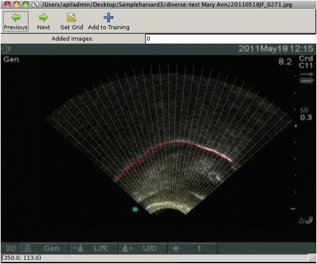
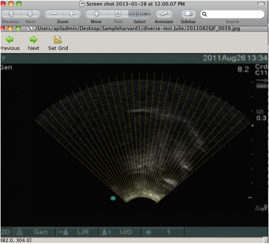
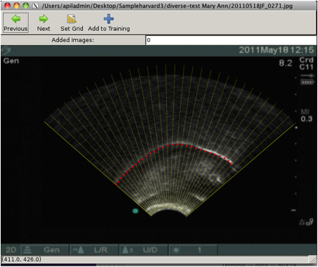
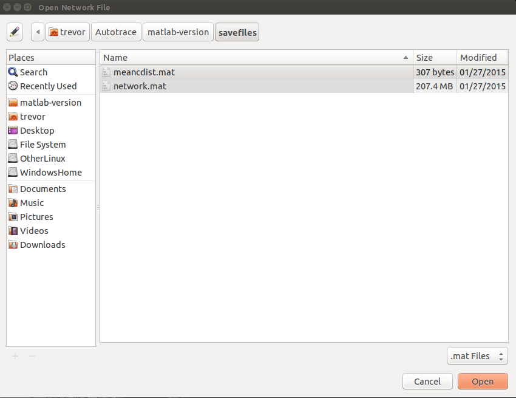
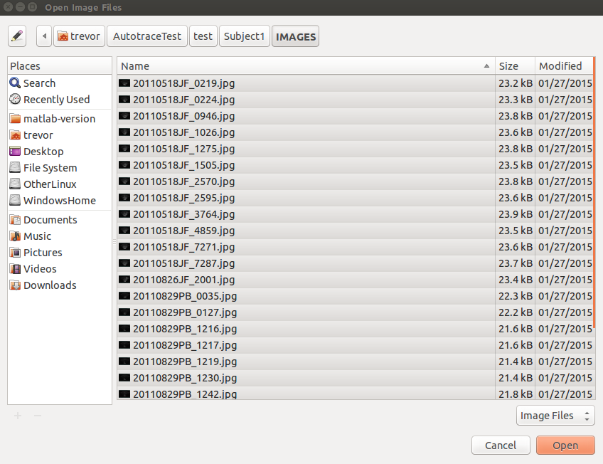

Using AutoTrace
====
>AutoTrace is a program used to take Ultrasound tongue images and trace the tongue. Data points are put along a fan-shaped grid over the image of the tongue in order to track the movement of the tongue during speech.

Locating AutoTrace Program
----
 + Open Program

 

[Open AutoTrace](../AutoTrace.py) by navigating to the matlab-version folder and typing the command `python AutoTrace.py`

Using Autotrace to trace manually
=====
Locating AutoTrace Program
----
 + Open Program

 

[Open AutoTrace](../AutoTrace.py) by navigating to the matlab-version folder and typing the command `python AutoTrace.py`

Adding Images to Autotrace
----

 + To import images, click __open__ button found on top left of program

 + To import multiple images: select first image, hold _shift_, and select last desired image

 + Once images are selected, click __open__

Viewing Images in Autotrace
----

 + Ensure that there is a trace file with the format `.traced.txt` in the same folder as the images

 + Import the images you want to view

 + Click the arrow pointing to the right, next to the "open network" button. 

 + You will be prompted to "Enter Tracer Information". Anything you enter will change the name on the tracing files, but will not change the content of the files. Click __OK__.

 + Use the arrow buttons at the top of the screen to navigate between images

Beginning Tracing
----

 + Select one image and click __view__ found on top center of program

 + A new window will open

 + When prompted, enter tracer information (first and last initials)

Setting the Grid
----

 + If yellow grid lines are not aligned with edges of image, click __set grid__ (at top of program) to remove the lines
  
 

 >An _incorrect_ example: grid-lines are not aligned with edges of image

 + Draw new grid lines from bottom left edge to top left edge and bottom right edge to top right edge
 >if drawn from right to left, the grid will be inverted and you will need to back out by closing out of the window and returning to __adding images__ section

 + The grid can only be set once while the image is open
 >if a mistake is made, you must back out to redraw the grid

Creating the Trace
----

>Image should appear as black with white line(s) splitting mouth into upper palate and tongue

 + Hold _left mouse button_ and trace line of tongue

 + Place dots starting from either left or right

>_Important:_ dots should be just below the white line, on the border between the white and black of the tongue image
 
>_Tip:_ it can help to draw rough arch, then fine tune dot placements (only one dot will appear per gridline)

 + If needed, hold _right mouse button_ and move over any existing dots to erase

 + When finished with image, click __next__ at top of program; work will automatically be saved

 + Old traces will be saved in separate folder

 + Once work is saved, it can accessed in __recent traces__ folder
 >The folder is automatically named with tracer information of all tracers who have placed traces in folder using AutoTrace

Tracing Guidelines
----

 + Dots should be just below white border

 + If the tongue border is unclear, do not place dots

 + If double tongue occurs, choose lower line (upper is usually palate)

 + If no distinct lines can be made out, the image may be “bad” and be untraceable

>Untraceable image

 + Some images may be distorted; if this occurs, do not attempt to trace

Checking Output
----

>A complete tongue tracing should now have a correct grid and accurately traced tongue image

Desired result

Using Autotrace to Trace Automatically
=====
 + Ensure that the ROI_config.txt file is in the same directory as the one containing your test images. 
 + Click the second icon from the left, "Load Network"
 
 + Select the _network.mat_ file in the _savefiles_ directory in your Autotrace folder and click _open_. 
 
 + Click the leftmost icon, "Load Images", select a test set of images and click _open_
 + Click the "gears" icon to begin tracing the images. At this point, __Matlab__ will start. You will see a notification window when it is finished. 

Exiting
----

 + Once finished with work, exit program, all work will be saved and you will be returned to initial AutoTrace screen

